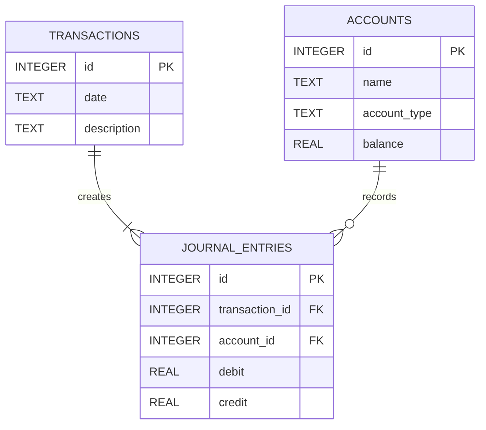

# Accounting System ERD (Entity Relationship Diagram)

Below is the database structure that powers our double-entry application.

## Entity-Relationship Visualization

## Relationships Explained
1. **`TRANSACTIONS` to `JOURNAL_ENTRIES` (1-to-Many):**
   * A single transaction always has multiple journal entries (at minimum, one debit and one credit) to satisfy the **double-entry** accounting equation.
2. **`ACCOUNTS` to `JOURNAL_ENTRIES` (1-to-Many):**
   * A single general ledger account (e.g. "Cash" or "Sales Revenue") can have many journal entries over time recorded against it, either increasing or decreasing its real-time `balance`.
